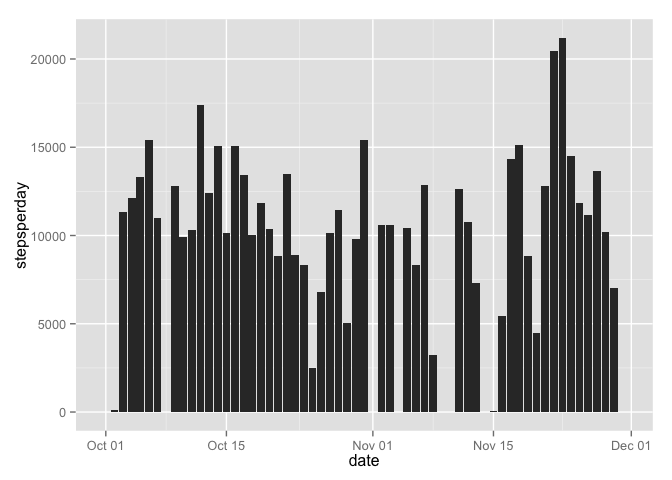
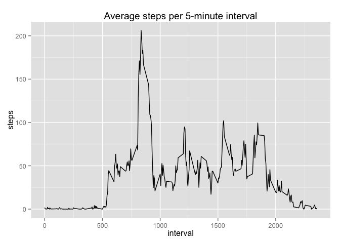
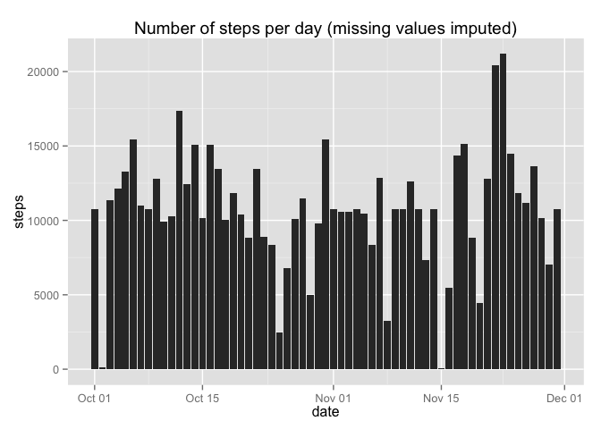
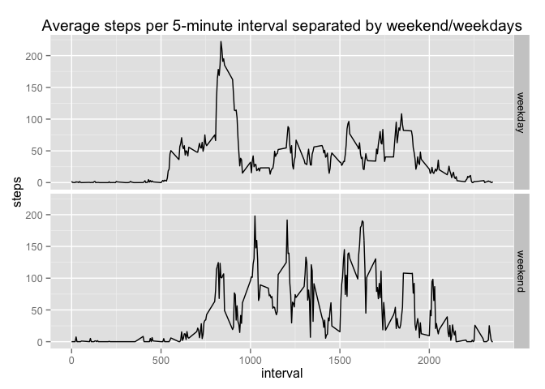

# Reproducible Research: Peer Assessment 1

In this report we'll analyze data from a personal activity monitoring device. The device collects data at 5 minute intervals through out the day. The data consists of two months of data from an anonymous individual collected during the months of October and November, 2012 and include the number of steps taken in 5 minute intervals each day.

## Loading and preprocessing the data
First, let's unzip the activity.zip file, if activity.csv is not yet in the working directory.

```r
if(!'activity.csv' %in% dir()){
    unzip('activity.zip')
    unlink('activity.zip')}
```
Then we'll Load the data, show the first six rows and transform the date variable into datetime objects with the lubridate package.

```r
data <- read.csv('activity.csv', header=TRUE, stringsAsFactors=FALSE)
head(data)
```

```
##   steps       date interval
## 1    NA 2012-10-01        0
## 2    NA 2012-10-01        5
## 3    NA 2012-10-01       10
## 4    NA 2012-10-01       15
## 5    NA 2012-10-01       20
## 6    NA 2012-10-01       25
```

```r
library(lubridate)
data$date <- ymd(data$date)
```

## What is the mean total number of steps taken per day?
With the plyr package we can easily create a new data frame that sums the total number of steps taken per day. 

```r
library(plyr)
stepsperday <- ddply(data, .(date), summarize, steps=sum(steps, na.rm=TRUE))
```

We then use this data frame to make a ggplot histogram of the total number of steps taken each day.

```r
library(ggplot2)
ggplot(stepsperday, aes(date, steps)) + geom_histogram(stat="identity") + ggtitle(("Number of steps per day"))
```

 

The histogram shows quite a lot of variation in the total number of steps taken between the days, as well as some days with 0 steps and/or missing values.

When calculating the mean and median total of steps taken per day, we see that the mean is a little lower than the median value.

```r
mean(stepsperday$steps)
```

```
## [1] 9354.23
```

```r
median(stepsperday$steps)
```

```
## [1] 10395
```

## What is the average daily activity pattern?
To analyze the average daily activity pattern, we can calculate the average number of steps taken in each 5-minute interval (i.e. the same daily interval averaged across all days) and create a time series plot.

```r
averageinterval <- ddply(data, .(interval), summarize, steps=mean(steps, na.rm=TRUE))
ggplot(averageinterval, aes(interval, steps)) + geom_line() + ggtitle("Average steps per 5-minute interval")
```

 

The plot shows that there is a spike in steps in the morning and few steps taken during the night.

We can also find the 5-minute interval which contains the maximum number of steps on average, across all the days in the dataset:

```r
head(averageinterval[with(averageinterval, order(steps, decreasing=TRUE)),], n=1)  
```

```
##     interval    steps
## 104      835 206.1698
```

## Imputing missing values
First, we count the number of missing values in the data set:

```r
sum(is.na(data))          # in total
```

```
## [1] 2304
```

```r
sum(is.na(data$steps))    # in steps variable
```

```
## [1] 2304
```
Then we'll use the mean number of steps for each interval to fill in these missing values and add these to the steps variable in a new dataset:

```r
# Subset the missing data
missing <- is.na(data$steps)
missing_entries <- data[missing, ]
# Calculate the means for each interval
meaninterval <- ddply(data, .(interval), summarize, steps=mean(steps, na.rm=TRUE))
# Create a vector with the average step values for all the missing data
imputed_values <- vector()
for(interval in missing_entries$interval){
    new_step <- meaninterval[meaninterval$interval==interval, 'steps']
    imputed_values <- c(imputed_values, new_step)
    }
# Add this vector to a new copy of the dataset in place of the missing values  
new_data <- data
new_data[missing, 'steps'] <- imputed_values
# Verify that there are no longer any missing data in the new dataset
sum(is.na(new_data))
```

```
## [1] 0
```

Now that the missing data has been imputed, let's see how the new data differs from the original data. First, by creating a histogram of the total number of steps taken per day:

```r
new_stepsperday <- ddply(new_data, .(date), summarize, steps=sum(steps))
ggplot(new_stepsperday, aes(date, steps)) + geom_histogram(stat="identity") + ggtitle(("Number of steps per day (missing values imputed)"))  
```

 

Unsurprisingly, the main difference with the histogram above is that there are now fewer days without any steps. 

Calculating the mean and median total of steps taken per day, we see that both values have increased substantially compared to the previous calculations:  

```r
mean(new_stepsperday$steps)
```

```
## [1] 10766.19
```

```r
median(new_stepsperday$steps)
```

```
## [1] 10766.19
```

## Are there differences in activity patterns between weekdays and weekends?
To answer this question, we'll first make a factor variable which indicates whether the date was in the "weekend" or a "weekday": 

```r
wkdays <- weekdays(data$date)
wkday_bool <- ifelse(wkdays %in% c("Sunday", "Saterday"), 1, 0)
weekday_factor <- factor(wkday_bool, labels=c("weekday", "weekend"))
data$weekdayfactor <- weekday_factor
```

Then we make a panel plot of the weekdays and the weekend, showing a time-series of the average steps taken in 5-minute intervals:

```r
averageinterval <- ddply(data, .(weekdayfactor, interval), summarize, steps=mean(steps, na.rm=TRUE))
ggplot(averageinterval, aes(interval, steps)) + geom_line() + 
    ggtitle("Average steps per 5-minute interval separated by weekend/weekdays") + facet_grid(weekdayfactor ~ .)  
```

 

As you can see in these plots, the amount of steps during a weekday is highest during the early 5-minute intervals in the morning. Whereas in the weekend, the activity is more spread out during the day and there is not one clear peak time in steps.
