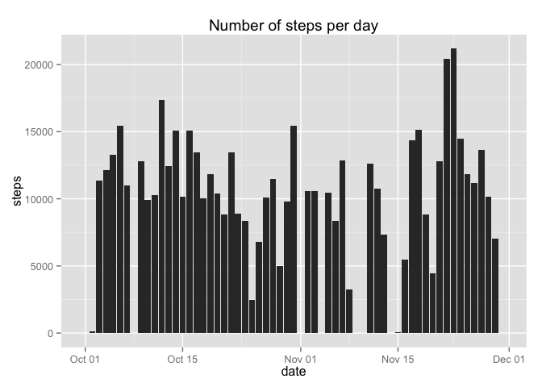

# Reproducible Research: Peer Assessment 1


## Loading and preprocessing the data
First unzip the activity.zip file, if activity.csv is not yet in the working directory.

```r
if(!'activity.csv' %in% dir()){
    unzip('activity.zip')
    unlink('activity.zip')}
```
Load the data and show first six rows.

```r
data <- read.csv('activity.csv', header=TRUE, stringsAsFactors=FALSE)
head(data)
```

```
##   steps       date interval
## 1    NA 2012-10-01        0
## 2    NA 2012-10-01        5
## 3    NA 2012-10-01       10
## 4    NA 2012-10-01       15
## 5    NA 2012-10-01       20
## 6    NA 2012-10-01       25
```
Transform the date variable into datetime objects with the lubridate package.

```r
library(lubridate)
data$date <- ymd(data$date)
```

## What is mean total number of steps taken per day?
Create a table with the plyr package that sums the number of steps per day. 

```r
library(plyr)
stepsperday <- ddply(data, .(date), summarize, steps=sum(steps, na.rm=TRUE))
```

Then make a ggplot histogram of the total number of steps taken each day.

```r
library(ggplot2)
ggplot(stepsperday, aes(date, steps)) + geom_histogram(stat="identity") + ggtitle(("Number of steps per day"))
```

 

Calculate the mean and median total of steps taken per day.

```r
mean(stepsperday$steps)
```

```
## [1] 9354.23
```

```r
median(stepsperday$steps)
```

```
## [1] 10395
```

## What is the average daily activity pattern?


## Imputing missing values


## Are there differences in activity patterns between weekdays and weekends?
