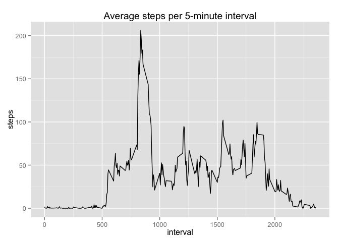

# Reproducible Research: Peer Assessment 1


## Loading and preprocessing the data
First unzip the activity.zip file, if activity.csv is not yet in the working directory.

```r
if(!'activity.csv' %in% dir()){
    unzip('activity.zip')
    unlink('activity.zip')}
```
Load the data and show first six rows.

```r
data <- read.csv('activity.csv', header=TRUE, stringsAsFactors=FALSE)
head(data)
```

```
##   steps       date interval
## 1    NA 2012-10-01        0
## 2    NA 2012-10-01        5
## 3    NA 2012-10-01       10
## 4    NA 2012-10-01       15
## 5    NA 2012-10-01       20
## 6    NA 2012-10-01       25
```
Transform the date variable into datetime objects with the lubridate package.

```r
library(lubridate)
data$date <- ymd(data$date)
```

## What is mean total number of steps taken per day?
Create a table with the plyr package that sums the number of steps per day. 

```r
library(plyr)
stepsperday <- ddply(data, .(date), summarize, steps=sum(steps, na.rm=TRUE))
```

Then make a ggplot histogram of the total number of steps taken each day.

```r
library(ggplot2)
ggplot(stepsperday, aes(date, steps)) + geom_histogram(stat="identity") + ggtitle(("Number of steps per day"))
```

 

Calculate the mean and median total of steps taken per day.

```r
mean(stepsperday$steps)
```

```
## [1] 9354.23
```

```r
median(stepsperday$steps)
```

```
## [1] 10395
```

## What is the average daily activity pattern?
Calculate the average number of steps taken in each five number interval (i.e. the same daily interval averaged across all days) and create a time series plot.

```r
averageinterval <- ddply(data, .(interval), summarize, steps=mean(steps, na.rm=TRUE))
ggplot(averageinterval, aes(interval, steps)) + geom_line() + ggtitle("Average steps per 5-minute interval")
```

 

The 5-minute interval which contains the maximum number of steps on average, across all the days in the dataset:

```r
head(averageinterval[with(averageinterval, order(steps, decreasing=TRUE)),], n=1)  
```

```
##     interval    steps
## 104      835 206.1698
```
## Imputing missing values
Count the number of missing values in the data set:

```r
sum(is.na(data))          # in total
```

```
## [1] 2304
```

```r
sum(is.na(data$steps))    # in steps variable
```

```
## [1] 2304
```
Fill in the missing values with the mean value for that interval and add this to a new dataset:

```r
# Subset the missing data
missing <- is.na(data$steps)
missing_entries <- data[missing, ]
# Calculate the means for each interval
meaninterval <- ddply(data, .(interval), summarize, steps=mean(steps, na.rm=TRUE))
# Create a vector with the average step values for all the missing data
imputed_values <- vector()
for(interval in missing_entries$interval){
    new_step <- meaninterval[meaninterval$interval==interval, 'steps']
    imputed_values <- c(imputed_values, new_step)
    }
# Add this vector to a new copy of the dataset
new_data <- data
new_data[missing, 'steps'] <- imputed_values
# Verify that there are no longer any missing data in the new dataset
sum(is.na(new_data))
```

```
## [1] 0
```

## Are there differences in activity patterns between weekdays and weekends?
